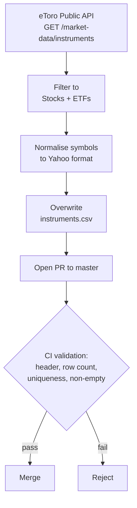

# etoro_tickers

Reference CSV of every stock and ETF tradeable on eToro, normalised to Yahoo Finance symbol format.

[](https://github.com/weirdapps/etoro_tickers/actions/workflows/ci.yml)
[](https://sonarcloud.io/summary/new_code?id=weirdapps_etoro_tickers)
[](LICENSE)

## What this repository is

A single-file, pure-data repository. `instruments.csv` holds every stock and ETF that eToro published through its Public API at the time of the last refresh, converted to Yahoo Finance symbol convention for use with libraries like `yfinance` and `pandas-datareader`. There is no application code. The repository exists so downstream tools can pin to a reviewed, versioned universe file rather than re-scraping the API on every run.

The conversion is not complete. 85 of the 12,544 symbols (0.68%) keep an eToro-side or Bloomberg-style code and will not resolve on Yahoo, so budget for lookup failures. See [Known symbol-format gaps](#known-symbol-format-gaps).

This file is a standalone snapshot with no automated consumer in this organisation. [`etorotrade`](https://github.com/weirdapps/etorotrade) does not read it: it keeps its own universe file at `yahoofinance/input/etoro.csv` (same three columns) and refreshes it weekly from the same eToro endpoint via `scripts/refresh_etoro_universe.py`.

## Dataset

Single file, `instruments.csv`. UTF-8, no BOM, header-first, comma-separated, three columns.

| Column | Description | Examples |
|---|---|---|
| `symbol` | Yahoo Finance style ticker | `AAPL`, `VOD.L`, `SAP.DE`, `9988.HK`, `VOLV-B.ST` |
| `company` | Issuer or fund name | `Apple`, `Volkswagen AG`, `Alibaba Group Holding Ltd (Hong Kong)` |
| `exchange` | eToro exchange label | `Nasdaq`, `NYSE`, `LSE`, `FRA`, `Hong Kong Exchanges` |

Snapshot facts (verified against the file at the last commit that touched it; check `git log -1 -- instruments.csv` for the date):

- 12,544 instruments across 32 distinct exchange labels.
- All symbols unique and non-empty (CI enforces both).
- 21 rows carry non-ASCII characters in `company` (e.g. `Wärtsilä Oyj Abp`, `Industrivärden, AB ser. A`).
- 78 `company` values carry leading or trailing whitespace (`" Vodafone Group PLC"`, `"Peabody Energy Corporation "`). Strip before matching on name.
- Line endings are CRLF.

### Symbol normalisation rules

Symbols mostly follow Yahoo Finance convention rather than eToro's native `.US` scheme:

- `.US` suffix stripped (`AAPL.US` becomes `AAPL`).
- Hong Kong tickers carry a `.HK` suffix and are usually zero-padded to 4 digits (`9988.HK`, `0939.HK`). 32 of the 243 are not (`3.HK`, `788.HK`, `ANT.HK`, `82318.HK`).
- Scandinavian dual-class shares hyphenated (`VOLV-B.ST`, `CARL-B.CO`, `ERIC-A.ST`). US dual-class shares are not: they stay dot-separated (`BRK.B`, `BF.A`), which is eToro's form, not Yahoo's `BRK-B`.
- `.RTH` (extended-hours) and `.DELISTED` variants excluded.
- eToro EUR-denominated shadow listings retained with a `.EUR` suffix (`AAPL.EUR`, `GOOG.EUR`, `META.EUR`); ten rows total. `.EUR` is not a Yahoo suffix.

### Known symbol-format gaps

85 rows (0.68%) are not in Yahoo convention and return no data through `yfinance`. Spot-checked: `BRK.B`, `3.HK`, `AAPL.EUR` and `IBCK.DE11` all resolve to zero rows, while `BRK-B`, `0003.HK`, `AAPL` and `VOLV-B.ST` resolve normally.

| Group | Rows | Examples |
|---|---:|---|
| Hong Kong codes not padded to 4 digits | 32 | `3.HK`, `788.HK`, `ANT.HK`, `CA376.HK` |
| Xetra ETF codes with a trailing `11`/`22` | 15 | `IBCK.DE11`, `IQQ6.D11`, `ICGB.DE22` |
| US dual-class written with a dot | 11 | `BRK.B`, `BF.A`, `LEN.B`, `PBR.A` |
| eToro EUR shadow listings | 10 | `AAPL.EUR`, `NVDA.EUR` |
| Bloomberg-style venue codes | 10 | `ITBL.IM`, `FORG.LN`, `TCOM.CH` |
| Warrants, CVRs and other eToro-only instruments | 7 | `WRTS.APRN.15`, `CVR.THS`, `GRP.U` |

Filter or remap these before feeding the file to a Yahoo client. CI does not check symbol resolvability, only schema and uniqueness.

### Exchange coverage

The 32 exchange labels present, ordered by instrument count. The API returns a numeric `exchangeID`, so these labels come from the mapping applied when the file was generated; a couple carry quirks worth noting when filtering (`LSE_AIM` uses an underscore, `Stockholm  Stock Exchange` contains a double space). Match against the exact strings below.

| Exchange | Rows |
|---|---:|
| Nasdaq | 3,660 |
| NYSE | 2,609 |
| LSE | 1,050 |
| Sydney | 852 |
| Euronext Paris | 572 |
| FRA | 531 |
| LSE_AIM | 488 |
| Stockholm  Stock Exchange | 430 |
| Xetra ETFs | 318 |
| Oslo Stock Exchange | 281 |
| Hong Kong Exchanges | 243 |
| Tokyo Stock Exchange | 225 |
| Borsa Italiana | 200 |
| Helsinki Stock Exchange | 175 |
| Euronext Amsterdam | 135 |
| Copenhagen Stock Exchange | 126 |
| OTC Markets Stock Exchange | 98 |
| Euronext Brussels | 95 |
| SIX | 67 |
| LSE AIM Auction | 67 |
| Bolsa De Madrid | 54 |
| Chicago Board Options Exchange | 51 |
| Vienna | 40 |
| Abu Dhabi | 34 |
| Euronext Lisbon | 31 |
| Dubai Financial Market | 29 |
| Warsaw | 26 |
| Budapest | 20 |
| Dublin EN | 18 |
| Prague SE | 9 |
| LSE Auction | 9 |
| Tadawul | 1 |

## Usage

Read straight from GitHub or clone the repo. With `pandas`:

```python
import pandas as pd

instruments = pd.read_csv("instruments.csv")

# Filter by exchange (use the exact label from the table above)
nasdaq = instruments[instruments["exchange"] == "Nasdaq"]

# Look up a specific ticker
apple = instruments[instruments["symbol"] == "AAPL"]

# Distribution across venues
instruments["exchange"].value_counts()
```

Pure stdlib works too, no dependencies required:

```python
import csv

with open("instruments.csv") as f:
    for row in csv.DictReader(f):
        print(row["symbol"], row["company"], row["exchange"])
```

## Data provenance and refresh

The dataset originates from a single eToro Public API call, filtered to stocks and ETFs, then run through the normalisation rules above.



There is intentionally no committed extractor. To refresh the file:

1. Call `GET https://www.etoro.com/api/public/v1/market-data/instruments` with the required headers (`X-API-KEY`, `X-USER-KEY`, `X-REQUEST-ID` as a UUID, and a `User-Agent`). The whole catalogue comes back in a single response under the `instrumentDisplayDatas` key; there is no pagination.
2. Filter to Stocks and ETFs, which are `instrumentTypeID` 5 and 6. Each record gives the symbol as `symbolFull` and the name as `instrumentDisplayName`. `exchangeID` is a numeric ID, not a label, so producing the `exchange` column needs your own ID-to-name mapping.
3. Apply the normalisation rules from the section above.
4. Overwrite `instruments.csv` and open a PR. CI will reject the change if the schema drifts, the row count falls below 1,000, symbols duplicate, or any symbol is empty.

`https://public-api.etoro.com/api/v1/market-data/instruments` serves the same payload from the legacy host. [`etorotrade/scripts/refresh_etoro_universe.py`](https://github.com/weirdapps/etorotrade/blob/master/scripts/refresh_etoro_universe.py) is a working implementation of the whole sequence, including an exchange ID map.

## Continuous integration

Three workflows:

- [`ci.yml`](.github/workflows/ci.yml): on push and pull request against `master`. Inline Python (3.12, stdlib only) that asserts the header is exactly `symbol,company,exchange`, that there are at least 1,000 rows, that every symbol is unique, and that no symbol is empty.
- [`sonarcloud.yml`](.github/workflows/sonarcloud.yml): on push to `master`, on any pull request, and on manual dispatch. SonarCloud scan on the non-CSV, non-doc surface (see `sonar-project.properties`). Skipped automatically if `SONAR_TOKEN` is not configured.
- [`dependabot-auto-merge.yml`](.github/workflows/dependabot-auto-merge.yml): on pull requests from Dependabot only, never on push. It is a thin caller for the shared reusable workflow at [`weirdapps/shared-workflows`](https://github.com/weirdapps/shared-workflows/blob/main/.github/workflows/dependabot-auto-merge.yml), which waits for this PR's other checks to go green and then squash-merges patch, minor, and grouped updates. A standalone major stays open for review.

Dependabot itself watches `github-actions` weekly (see [`.github/dependabot.yml`](.github/dependabot.yml)).

## Local validation

Run the same check CI runs, against your working tree:

```bash
python - <<'PY'
import csv
rows = list(csv.DictReader(open("instruments.csv")))
assert list(rows[0].keys()) == ["symbol", "company", "exchange"], "header mismatch"
assert len(rows) >= 1000, f"only {len(rows)} rows"
symbols = [r["symbol"] for r in rows]
assert len(set(symbols)) == len(symbols), "duplicate symbols"
assert all(r["symbol"].strip() for r in rows), "empty symbol"
print(f"OK: {len(rows)} instruments")
PY
```

## Security

See [SECURITY.md](SECURITY.md). Report vulnerabilities privately through this
repository's **Security** tab, not as public issues.

## License

[MIT](LICENSE). Copyright (c) 2026 Dimitris Plessas.
